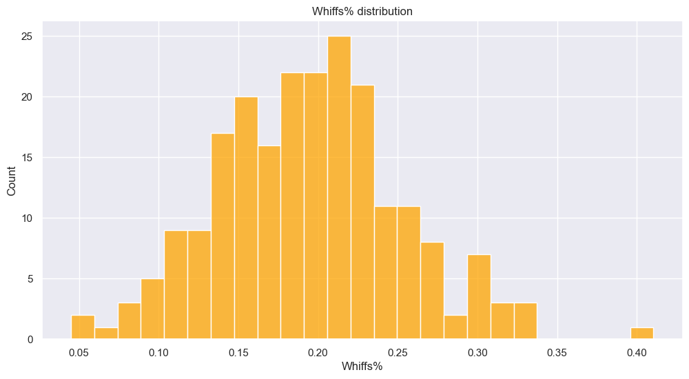

# MLB-Hitting-Analysis

## Introduction
This project is designed for analyzing MLB players hitting fastballs in 2024 regular season games. Hitters' performance will be evaluated through several aspects, including contact, power, displine, and consistancy. All the data used in this research come from statcast, which can be reached from the official website.

## Contact Ability Analysis
To analyze a player's contact ability, I mainly focus on batting average and contact rate. One important feature is Whiffs, which represents how many times a player swing but not make contact with the ball, then I create a varable Whiffs% = Whiffs / Swing.

The following graph shows the Whiffs% distribution.

